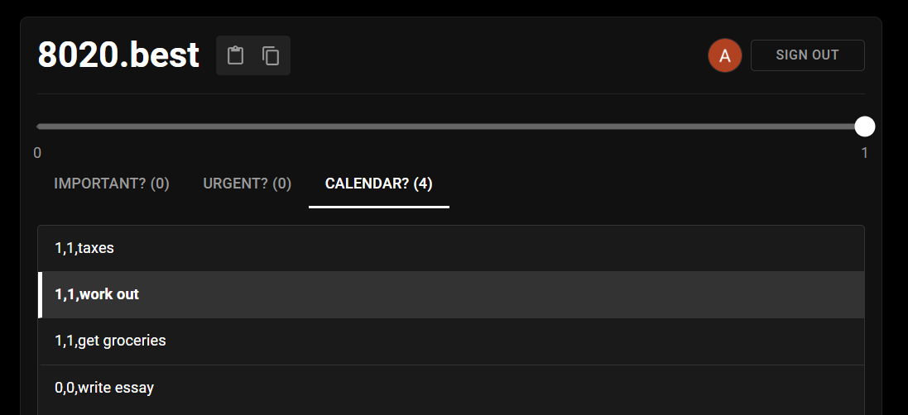

# 8020.best - AI-Powered Task Prioritization

**8020.best** is a smart task management application that uses AI to automatically categorize your tasks using the Eisenhower Matrix. Stop guessing what to work on and let the AI tell you what's important and what's urgent.



## Key Features

- **AI-Powered Prioritization**: Automatically sorts your tasks into the four quadrants of the Eisenhower Matrix:
    - Important & Urgent (Do)
    - Important & Not Urgent (Schedule)
    - Not Important & Urgent (Delegate)
    - Not Important & Not Urgent (Delete)
- **Enhanced AI Analysis**: Our new AI system provides:
    - **Confidence Scoring**: See how confident the AI is about each classification.
    - **Detailed Reasoning**: Understand *why* a task was categorized a certain way.
    - **Ensemble Methods**: Combines multiple AI models, rule-based logic, and keyword analysis for higher accuracy.
- **User Context Awareness**: The AI considers your personal goals and the time of day for more relevant suggestions.
- **Modern UI**: A clean, responsive interface for managing your tasks.
- **Secure Authentication**: User accounts are secured with Firebase Authentication.
- **Credit System**: Get started with free credits, with the option to purchase more.

## Tech Stack

| Area      | Technology                                                                                                   |
|-----------|--------------------------------------------------------------------------------------------------------------|
| **Frontend**  | [React](https://reactjs.org/), [Vite](https://vitejs.dev/), [Material-UI](https://mui.com/), [Axios](https://axios-http.com/) |
| **Backend**   | [Node.js](https://nodejs.org/), [Express](https://expressjs.com/), [Mongoose](https://mongoosejs.com/)                   |
| **Database**  | [MongoDB](https://www.mongodb.com/)                                                                          |
| **AI Model**  | [Replicate](https://replicate.com/) (GPT-4o-mini, Claude 3.5 Sonnet)                                         |
| **Auth**      | [Firebase Authentication](https://firebase.google.com/docs/auth)                                             |
| **Payments**  | [Stripe](https://stripe.com/)                                                                                |

## Getting Started

### Prerequisites
- [Node.js](https://nodejs.org/en/download/) (v16 or higher) and npm
- [MongoDB](https://www.mongodb.com/try/download/community) instance (local or cloud)
- A [Firebase](https://firebase.google.com/) project for authentication
- A [Replicate](https://replicate.com/) account for AI analysis API token

### Installation & Setup

1.  **Clone the repository:**
    ```bash
    git clone <repository-url>
    cd 8020.best
    ```

2.  **Install root dependencies:**
    ```bash
    npm install
    ```

3.  **Install backend and frontend dependencies:**
    ```bash
    cd backend && npm install
    cd ../frontend && npm install && cd ..
    ```

4.  **Set up Environment Variables:**

    -   **Backend:** Copy the example file and fill in your credentials.
        ```bash
        cp backend/.env.example backend/.env.development
        ```
        Your `backend/.env.development` file should look like this:
        ```env
        MONGO_URI="your_mongodb_connection_string"
        REPLICATE_API_TOKEN="your_replicate_api_token"
        STRIPE_SECRET_KEY="your_stripe_secret_key"
        JWT_SECRET="your_jwt_secret"
        ```

    -   **Frontend:** Create a `.env.development` file in the `frontend` directory and add your Firebase config.
        ```env
        VITE_API_URL="http://localhost:5000/api"
        VITE_FIREBASE_API_KEY="your_firebase_api_key"
        VITE_FIREBASE_AUTH_DOMAIN="your_firebase_auth_domain"
        VITE_FIREBASE_PROJECT_ID="your_firebase_project_id"
        VITE_FIREBASE_STORAGE_BUCKET="your_firebase_storage_bucket"
        VITE_FIREBASE_MESSAGING_SENDER_ID="your_firebase_sender_id"
        VITE_FIREBASE_APP_ID="your_firebase_app_id"
        ```

5.  **Run the application:**
    This command starts both the frontend and backend servers concurrently.
    ```bash
    npm run dev
    ```
    - Frontend will be available at `http://localhost:3000`
    - Backend will be available at `http://localhost:5000`

## API Endpoints

The enhanced AI analysis is handled by the following endpoints:

-   `POST /api/ai/analyze-task`
    -   Analyzes a single task and returns its classification with confidence and reasoning.
    -   Body: `{ "task": "your task text", "userContext": {} }`

-   `POST /api/ai/analysis-stats`
    -   Analyzes a batch of tasks and returns the results along with aggregate statistics (average confidence, etc.).
    -   Body: `{ "tasks": ["task1", "task2"], "userContext": {} }`

-   `GET /api/ai/test`
    -   A simple test endpoint to check if the AI service is running.

## Project Structure
```
/
├── backend/
│   ├── routes/         # Express routes (e.g., ai.js, users.js)
│   ├── services/       # Business logic (e.g., taskAnalysis.js)
│   ├── models/         # Mongoose schemas
│   ├── middleware/     # Custom middleware
│   └── server.js       # Main backend server file
├── frontend/
│   ├── src/
│   │   ├── components/ # React components
│   │   ├── services/   # API clients (e.g., aiPrioritization.js)
│   │   ├── contexts/   # React contexts (e.g., AuthContext)
│   │   └── App.jsx     # Main app component
└── README.md
```

## Setup Instructions

### Prerequisites
- Node.js 14+ and npm
- MongoDB database
- Firebase project (for authentication)
- Replicate API account (for AI analysis)

### Environment Variables Setup

For security reasons, environment variables containing API keys and credentials are not committed to version control. Follow these steps to set up your environment:

1. **Backend Setup**
   - Copy `.env.example` to create new `.env.development` and `.env.production` files:
   ```bash
   cp backend/.env.example backend/.env.development
   cp backend/.env.example backend/.env.production
   ```
   - Edit these files to add your actual credentials:
     - `MONGO_URI` - Your MongoDB connection string
     - `STRIPE_SECRET_KEY` - Your Stripe secret key (for payments)
     - `STRIPE_WEBHOOK_SECRET` - Your Stripe webhook secret
     - `REPLICATE_API_TOKEN` - Get from https://replicate.com/account/api-tokens
     - `JWT_SECRET` - A secure random string for JWT authentication

2. **Frontend Setup**
   - Copy `.env.example` to create new `.env.development` and `.env.production` files:
   ```bash
   cp frontend/.env.example frontend/.env.development
   cp frontend/.env.example frontend/.env.production
   ```
   - Edit these files to add your Firebase credentials:
     - `VITE_FIREBASE_API_KEY` - Firebase API key
     - `VITE_FIREBASE_AUTH_DOMAIN` - Firebase auth domain
     - And other Firebase configuration values

### Installation

1. **Install root dependencies**
   ```bash
   npm install
   ```

2. **Install frontend and backend dependencies**
   ```bash
   cd frontend && npm install
   cd ../backend && npm install
   cd ..
   ```

3. **Start the development server**
   ```bash
   npm run dev
   ```
   This will start both frontend and backend in development mode.

## Credit System

- New users start with 100 free credits
- Each task analyzed consumes 1 credit
- Additional credits can be purchased through the application

## Security Best Practices

- **Environment Variables**: Never commit actual API keys or secrets to version control
- **Development**: For local development, use the mock authentication option if Firebase auth fails
- **API Security**: The backend implements rate limiting and proper authentication

## Deployment

Follow these steps to deploy the application:

1. Build the frontend:
   ```bash
   cd frontend && npm run build
   ```

2. Set up your production environment variables using your hosting provider's environment management

3. Deploy the backend to your server or cloud provider

## License

[MIT License](LICENSE)